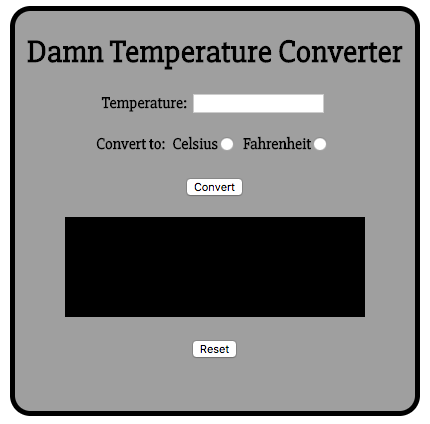
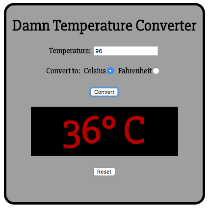
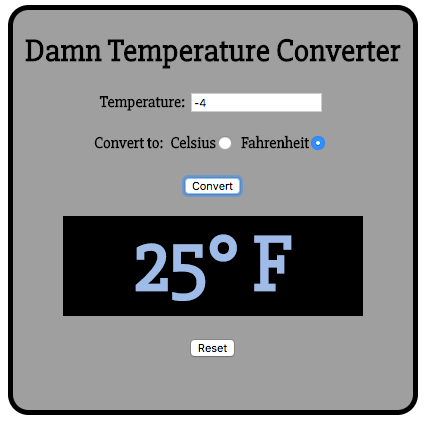
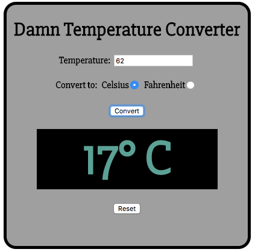

# Temperature Converter

# Temperature Converter

> Nashville Software School, Full-Stack Dev Bootcamp, Front-End Independant Exercise
> 

## Requirements


Write a program that will convert a temperature from fahrenheit to celsius, or from celsius to fahrenheit.

1. In the HTML, have one input field where someone can enter
  in a temperature.
2. Create a radio button group where Celsius or Fahrenheit 
  can be selected as the scale that the number should be 
  converted to.
3. Create a block level element that will hold the text of the
  converted temperature.
4. Create a button that, when clicked, displays the converted
  temperature.
5. Create another button that, when clicked, clears any text
  in the input field.
6. Add an event handler to the input field that checks if the 
  user pressed the enter key, and if that happens, perform
  the conversion.
  
  
7. If the temperature is greater than 90F/32C the color of 
  the converted temperature should be red.
  
  
8. If the temperature is less than 32F/0C the color of 
  the converted temperature should be blue.
  
  
9. For any other temperature, the color should be green.

	


### How to run (Node must be installed on your machine):
```
git clone https://github.com/lady-ace/temperature-converter
cd temperature-converter
npm install http-server -g
http-server -p 8080
```

This will show in your browser at:
`http://localhost:8080`

### Contributors:
[Jessica Brawner](https://github.com/lady-ace)